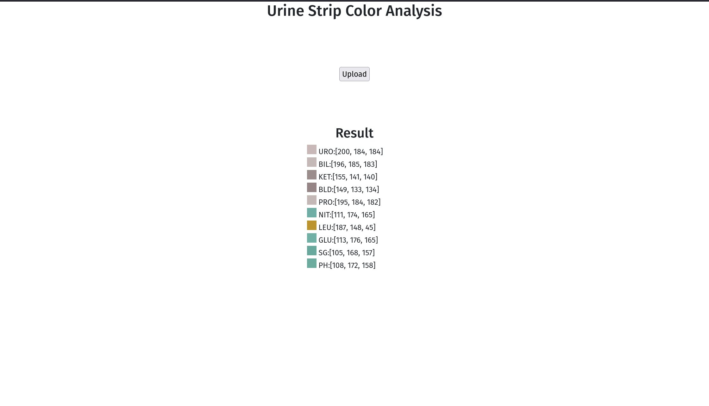
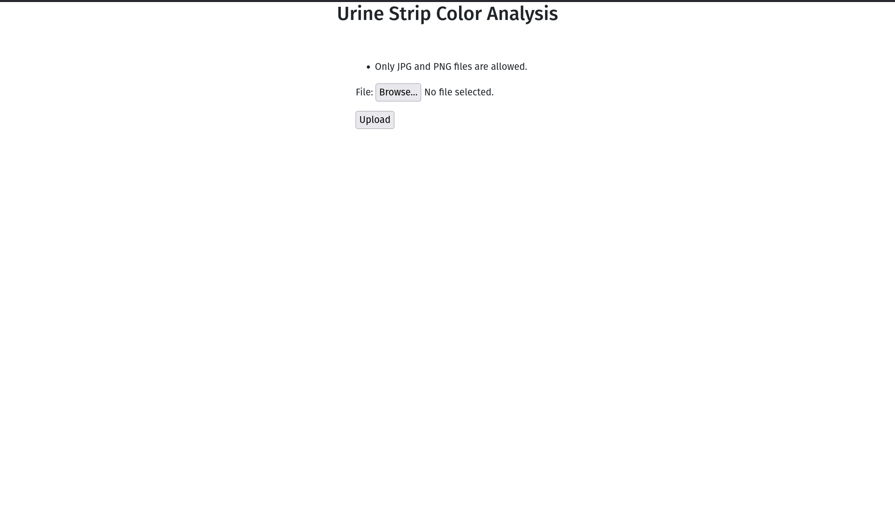

# Urine Test Color Identifier 🧪
##### Due to time constraints I could not rewrite the application in Flask.

### Relevant Files
- [Color Extraction](/color_extract/extract_color.py)
- [Views](/color_extract/views.py)
- [Tests](/color_extract/tests.py)
- [Strip Model](/color_extract/models.py)
- [Strip Form](/color_extract/forms.py)
  
_Code is commented._

### How to run
- Clone the repo
- `cd main`
- run `pip install -r requirements.txt`
- `python manage.py runserver`

### How to run Tests locally(There is a CI pipeline setup)
- Clone the repo
- `cd main`
- run `pip install -r requirements.txt`
- `python manage.py test color_extract`

### Web App
TechStack used:
- Django
- OpenCV
- Bootstrap

**How it works**
- user makes a POST request by uploading appropriate file
- **Note:** Only jpg,png,jpeg files are allowed. Otherwise user gets an error message asking them to do the same
- The uploaded file is passed through `color_extract` function
  - Uses Otsu Thresholding to convert the grayscale image to a binary image, from which the contours are extracted.
  - Within a for loop of the sorted contours, `cv2.boundingRect(contour)` extracts the x,y coordinates along with the width and height of rectangle for each contour.
  - This is then used to isolate the region of interest and the first pixel([0,0]) is used to identify the color
- returns color_value dict. This is saved as an object instance `StripFile` along with the image.
- renders the value dict on the same webpage

### Output

